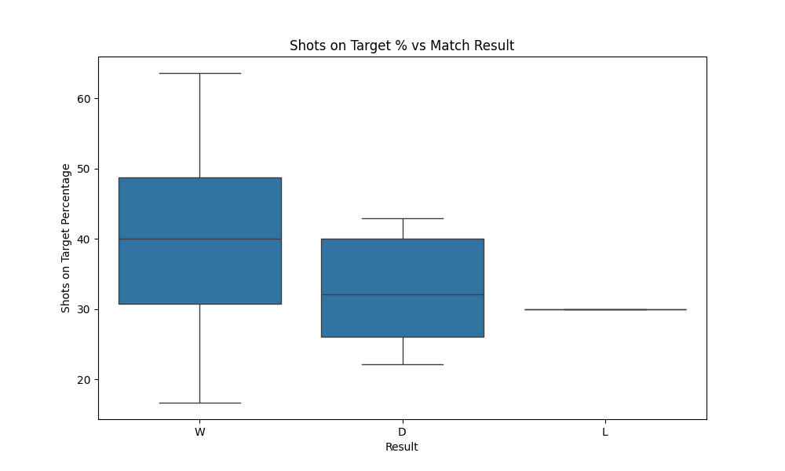
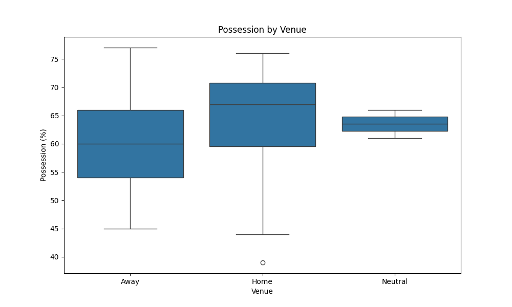
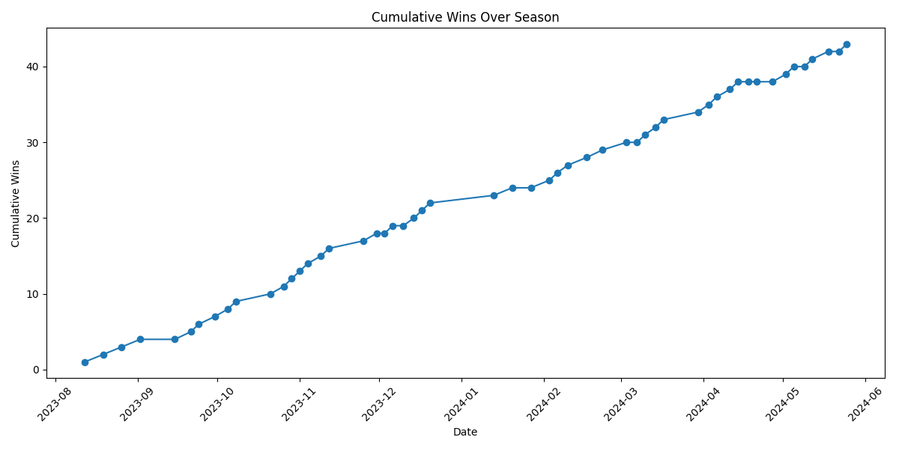

# FBREF Analysis — Football Matchlogs (Python)

A football analytics project that collects team match logs from FBref with Selenium and produces visualizations using pandas and Matplotlib.

- Data source: https://fbref.com
- Owner: 1128alex

## ✨ Features
- Automated matchlog collection from FBref via Selenium (configurable team/season/categories)
- Environment-based configuration using `.env` (user agent, Chrome binary path)
- Clean CSV export to `data/` and ready-to-run analysis scripts
- Multiple visualization scripts exploring trends (possession, shots, formations, progressive actions, etc.)
- Results saved as PNGs to `result/` (some charts in `data/` depending on script)

## 🛠️ Tech Stack
- Python (pandas, matplotlib, seaborn)
- Selenium (Chrome)
- python-dotenv (for environment variables)

## 📁 Project Structure (key parts)
```
.
├─ .env                     # private config (user agent, chrome path, etc.)
├─ .gitignore
├─ analysis_plan.txt        # ideas and analysis checklist (Korean + notes)
├─ data/
│  ├─ bayer04_2023_2024_matchlog.csv
│  ├─ spurs_2023_2024_matchlog.csv
│  └─ data_collection.py    # (legacy/placeholder; main collector is at repo root)
├─ data_collection.py       # Selenium collector (FBref → CSV in data/)
├─ main.py                  # Progressive passes vs carries (scatter) → result/passvscarry.png
├─ main2.py                 # Multi-viz for Bayer 04 dataset → result/*.png
├─ main3.py                 # Custom Spurs analyses → data/*.png
└─ result/
   └─ (charts written here by scripts)
```

## 🧪 Example Visualizations
Below are a few images produced by the included scripts (paths relative to the repo root):

- Progressive passes vs carries distance (by result):

  

- Shots on target % vs result:

  

- Possession by venue (Home/Away):

  

- Cumulative wins over season:

  

- Average goals for by captain (Spurs):

  

Note: If an image doesn’t render yet, run the corresponding script in the sections below to generate it.

## 🚀 Getting Started (Local)

1) Python environment

2) Install dependencies
```powershell
pip install pandas matplotlib selenium python-dotenv
```

3) Configure environment variables
Create a `.env` file in the project root (values are examples; adjust for your system):
```bash
USER_AGENT=\{Your user agent\}
CHROME_DRIVER_PATH=\{Your path to chrome driver\}
```
- USER_AGENT: browser user agent string for Selenium requests
- CHROME_DRIVER_PATH: full path to your Chrome executable

4) Collect data
```powershell
python data_collection.py
```
By default the script uses team = "spurs" and season = "2023-2024", exporting to `data/spurs_2023_2024_matchlog.csv`.
You can customize team/season/categories inside `data_collection.py` to collect datasets you want.

5) Run analyses
- Progressive actions vs carries (scatter):
```powershell
python main.py
```
Outputs: `result/passvscarry.png`

<!-- - Bayer 04 multi-viz (boxplots, trends, distributions):
```powershell
python main2.py
```
Outputs: `result/*.png` (shots_on_target_vs_result, possession_by_venue, goals_for_343_vs_others, average_shot_distance_distribution, cumulative_wins, pass_success_trend)

- Spurs custom analyses (attendance/result, goals vs xG, captain impact):
```powershell
python main3.py
```
Outputs: `data/attendance_vs_result.png`, `data/goals_vs_xg.png`, `data/avg_goals_by_captain.png` -->

## 📄 License
Please credit the author when you use parts of this repository.